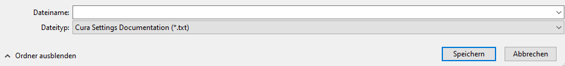
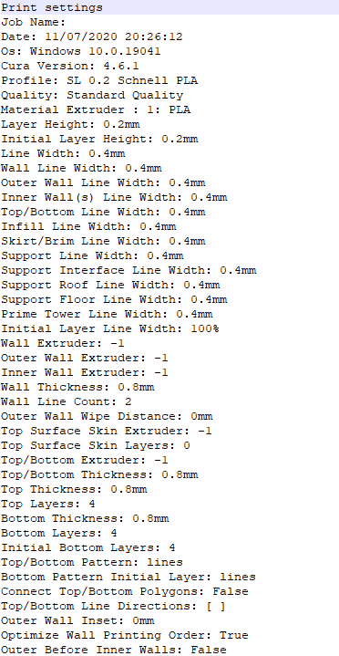

# TXT Cura Settings
Cura Plugin for Exporting Settings to an TXT file.

Forked from 5axes Html Cura Settings : [https://github.com/5axes/CuraSettingsWriter](https://github.com/5axes/CuraSettingsWriter)

Initial Source from Johnny Matthews :  [github.com/johnnygizmo/CuraSettingsWriter](https://github.com/johnnygizmo/CuraSettingsWriter)

It creates an extra menu option under File -> "Save Project..." that allows you to save all of the settings to an TXT file for easy comparing profiles. 

Hereafter a sample screenshot of what you get as result.

## Modifications

- 1.0.3 Parameters are now translated in the native langage choosen in the Cura settings
- 1.0.4 Html cleanup, no more jquery dependency,  thanks to [etet100](https://github.com/etet100) 